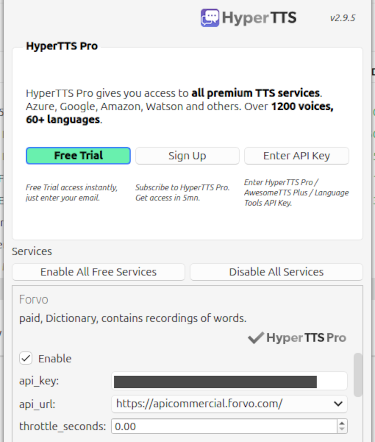

# Lexique Sound Flashcard Generator For Anki
> Generates high quality French flashcards for Anki.
> 
## Getting Started

If you're not familiar with Anki, you should start there:
[Get latest release](https://github.com/ankitects/anki/releases)
 
[Register with AnkiWeb (their 'cloud')](https://ankiweb.net/decks)

This project comes bundled with the Lexique and DELA dictionary however they can be found at: 
[Lexique](http://www.lexique.org/)
 
[DELA dictionary](https://infolingu.univ-mlv.fr/DonneesLinguistiques/Dictionnaires/telechargement.html)

## Project Description
This project generates French - Target Language flashcards for Anki.

The Target Language is generated by DeepL and defaults to English. It is configurable in step 3.

DeepL was chosen for its ease of signup and is free up to certain number usage limit. See their website for details.  AWS Translate support may also be coming in future updates.

### Project Structure

Python files correspond to steps (s1..s5).
1. Step 1: Filter bogus data from the Lexique.
2. Step 2: Intermix based on spoken/written frequency and export results into csv files.
3. Step 3: Generate the files that will be imported into Anki.
4. Step 4. Even out the number of rows in our exported csv's so that each will make exactly 500 (by default) cards.
5. Step 5. Clean audio created by hyperTTS.

I'd like to revise this project so that everything could be configured and run from one file, however, that will have to wait.

# Installation / Instructions

1. Clone or download this repository.
2. [Optional] Change default configuration in python files.
   - Default output location is under your project location's 'default_output' folder.
3. Register for DeepL API (free version is fine) and copy your API (auth) key into project_credentials.txt
4. Register for desired audio API (recommend Forvo API).
5. Run python files 1 through 4.
6. Open Anki and add a new Note Type with fields ['Lemma', 'Noun Declension', 'Pronunciation', 'Sound', 'English Meaning', 'POS', Deck Id'].
   - Select 'Tools'
   - Select 'Manage Note Types'
   - Select 'Add'
   - Select preferred type -recommend: 'Add Basic (and reverse card)'
   - Enter your Note Type name and select 'Ok'
   - Close/exit window
7. In Anki, under tab Decks, create desired Decks via 'Create Deck'.
8. [Follow guide to import decks from files](https://www.youtube.com/watch?v=_7hMmr0PEPQ)
9. [Follow guide to add audio from HyperTTS](https://www.youtube.com/watch?v=QYK2GPxksq4)
   - Note: You can use the Forvo API directly as shown below.
     - <i>Hint: Select the 'api:url' field to toggle the url as desired.</i> 
   
10. If desired, run python 5 to remove background noise and normalize volume.
    - Recommended if you chose a hyperTTS audio service that uses human generated clips (i.e. Forvo).
    - Note: Ensure no targeted audio files are open in other applications.
11. Close and reopen Anki.
12. Paste formatting rules from `'resources/Anki Card Formats'` into their respective Card types. The styling will be the same for both Fr to Target Langauge and Target Language to French.
13. I recommend syncing to AnkiWeb so that your work is backed up. That's it!

## Contributing

Specific wishlist:
- Step 5 wraps ffmpeg and ffmpeg-normalize calls with subprocess. These commands are shell commands which are natually platform dependant. Pretty much every subprocess call needs to be replaced with ffmpeg libraries. This would require making Python bindings, importing the modules, and of course translating from the existing commands to the library function calls.

Bug fixes, issue reporting, and PRs are welcome. 

## Licensing/Resources

This project utilizes the Lexique 3.83 corpus and DELA dictionary.

### Lexique 
Any flashcards generated using the Lexique fall under its derivative licensing. This project itself is not a derivative work.

#### [Attribution-NonCommercial 4.0 International Licensing Info](https://creativecommons.org/licenses/by-nc/4.0/):
###### Commercial Use
> "The Lexique and its derivative works "may not [be used]... for commercial purposes."
###### Required Credit
> "This project hereby provides credit to the Lexique project, provides a link to its license, and states that the this project will make changes to the Lexique in a reasonable manner in compliance with its license and acknowledges that in no way does this use suggest that the licensor endorses this project's creator(s) or their use."

### DELA French dictionary
This project includes the DELA French dictionary for convenience. Otherwise this project itself is not a derivative work.
> Paragraph 3 of the LGPLLR: "...by reading it or being compiled or linked with it, is called a "work that uses the Linguistic Resource". Such a work, in isolation, is not a derivative work of the Linguistic Resource, and therefore falls outside the scope of this License."

#### [Lesser General Public License For Linguistic Resources Licensing Info](https://infolingu.univ-mlv.fr/DonneesLinguistiques/Lexiques-Grammaires/lgpllr.html):

###### Commercial Use
No generated data is actually directly derivative of this resource therefore no commercial restrictions exist on account of this resource.

###### Required Credit
This project packages the original inflected form of the DELA French dictionary provided by the former Laboratoire d'Automatique Documentaire et Linguistique (LADL), now integrated into Institut Gaspard Monge (IGM) of the Université Gustave Eiffel which uses the LGPLLR license.

## Meta
Distributed under the MIT license and derivative licenses where applicable.

## Disclaimer
This software is provided "as is", without warranty of any kind, express or implied, including but not limited to the warranties of merchantability, fitness for a particular purpose, and noninfringement. In no event shall the authors or copyright holders be liable for any claim, damages, or other liability, whether in an action of contract, tort, or otherwise, arising from, out of, or in connection with the software or the use or other dealings in the software.